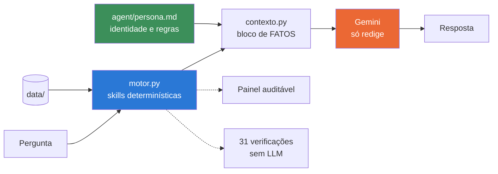

# 🧭 Rumo — Assistente de Planejamento de Metas Financeiras

> Um agente de IA que ajuda a pessoa a descobrir se as metas financeiras dela
> cabem no orçamento. Com uma decisão de arquitetura no centro:
> **o modelo de linguagem não faz contas.**

**Lab da DIO:** [Construa Seu Assistente Virtual Com Inteligência Artificial](https://github.com/digitalinnovationone/dio-lab-bia-do-futuro)
**Autora:** [Andressa Cristiny](https://github.com/AndressaCristiny)

---

## O problema

Quem tem duas metas financeiras costuma avaliar uma de cada vez. O cliente desta
base quer fechar a reserva de emergência até junho de 2026 e juntar a entrada de
um apartamento até dezembro de 2027.

A reserva cabe no orçamento dele? **Cabe** — exige R$ 714,29 por mês, e sobram
R$ 2.202,77.
A entrada cabe? **Cabe** — exige R$ 1.800,00 por mês.

As duas juntas? **Não.** Elas somam R$ 2.514,29 e disputam a mesma sobra.
Faltam **R$ 311,52 todo mês**, e nada no extrato avisa isso.

Esse número não está em nenhum arquivo de dados — ele só existe porque foi
calculado. Um assistente que apenas recuperasse trechos da base não teria como
responder "não, não dá".

O segundo problema é de confiança: um assistente financeiro que erra uma conta é
pior que nenhum assistente.

## A solução



Em azul, onde os números nascem. Em laranja, onde o texto nasce. Em verde, a
definição do agente — que é um arquivo de texto, não código. Os três não se
misturam, e é isso que torna o agente auditável.

O modelo recebe os valores **já calculados** e a instrução explícita de não
somar, dividir nem estimar. A alucinação mais perigosa em finanças — o erro
aritmético dito com segurança — deixa de ser possível. Não porque o prompt pediu
com jeitinho: porque a conta não passa pelo modelo.

## O agente

A definição do Rumo mora em arquivos de texto, lidos em tempo de execução. O
índice completo está em [`AGENTS.md`](AGENTS.md).

```
agent/
├── persona.md          identidade, papel, regras, tom de voz  →  system_instruction
├── prompts/            7 comandos prontos (1 arquivo = 1 botão na tela)
└── skills/             contrato das 4 capacidades determinísticas
```

**Não existe cópia do system prompt dentro do Python.** Se `agent/persona.md`
desaparecer, o app não sobe — de propósito. E uma das verificações automáticas
(`D3`) falha se alguém recolocar um trecho da persona no código: é exatamente
assim que documentação e comportamento voltariam a divergir em silêncio.

Mexer no agente não exige mexer em Python:

| Quero… | Edito |
|---|---|
| mudar o tom ou uma regra | `agent/persona.md` |
| acrescentar um comando | um novo `.md` em `agent/prompts/` |
| documentar uma capacidade | uma pasta nova em `agent/skills/` |

### Comandos prontos

Cada arquivo em `agent/prompts/` vira um botão na interface e um comando de
terminal. O caso central é `conflito-de-metas`.

```bash
python src/rumo.py                      # lista os comandos
python src/rumo.py conflito-de-metas    # roda um
python src/rumo.py --todos --md         # roda todos, em markdown
```

### Skills

| Skill | Responde | Função |
|---|---|---|
| [`analisar-orcamento`](agent/skills/analisar-orcamento/SKILL.md) | quanto entra, sai e sobra por mês | `motor.analisar_orcamento` |
| [`analisar-metas`](agent/skills/analisar-metas/SKILL.md) | quanto falta e qual o aporte de cada meta | `motor.analisar_metas` |
| [`detectar-conflito-de-metas`](agent/skills/detectar-conflito-de-metas/SKILL.md) | as metas cabem **juntas**? | `motor.conflito_de_metas` |
| [`filtrar-produtos-compativeis`](agent/skills/filtrar-produtos-compativeis/SKILL.md) | o que respeita perfil, prazo e aporte | `motor.produtos_compativeis` |

As skills **não** são chamadas pelo modelo. Elas rodam antes da conversa e o
resultado chega pronto no bloco `FATOS`. Isso é escolha de arquitetura: o número
fica igual para a mesma pergunta, o cálculo é testável sem LLM e sem rede, e a
alucinação numérica fica sem espaço.

## O que o Rumo faz

- ✅ Lê 3 meses de extrato e calcula quanto sobra de verdade por mês
- ✅ Para cada meta: quanto falta, aporte mensal necessário, se cabe, e quando
  chegaria no ritmo atual
- ✅ **Soma os aportes** e avisa quando o conjunto de metas não cabe
- ✅ Filtra produtos compatíveis por regra — risco, prazo e aporte mínimo
- ✅ Diz "não tenho essa informação" quando é o caso

## O que o Rumo não faz

- ❌ Não recomenda produto específico — explica as alternativas compatíveis
- ❌ Não promete rentabilidade nem projeta retorno futuro
- ❌ Não faz nenhuma conta dentro do modelo de linguagem
- ❌ Não responde fora de planejamento financeiro pessoal
- ❌ Não substitui um profissional certificado

## Os 6 passos do desafio

| # | Etapa | Onde está |
|---|---|---|
| 1 | Documentação do agente | [`AGENTS.md`](AGENTS.md) · [`agent/`](agent/) · [`docs/01-documentacao-agente.md`](docs/01-documentacao-agente.md) |
| 2 | Base de conhecimento | [`data/`](data/) · [`docs/02-base-conhecimento.md`](docs/02-base-conhecimento.md) |
| 3 | Prompts | [`agent/persona.md`](agent/persona.md) · [`agent/prompts/`](agent/prompts/) · [`docs/03-prompts.md`](docs/03-prompts.md) |
| 4 | Aplicação funcional | [`src/`](src/) |
| 5 | Avaliação e métricas | [`docs/04-metricas.md`](docs/04-metricas.md) · [`avaliacao/`](avaliacao/) |
| 6 | Pitch | [`docs/05-pitch.md`](docs/05-pitch.md) |

## Avaliação

**31 verificações automáticas que rodam sem LLM nenhum:**

```bash
python avaliacao/avaliar.py
```

```
=== CORREÇÃO DO CÁLCULO ===             8/8   PASSA
=== CONSISTÊNCIA INTERNA ===            6/6   PASSA
=== REGRAS DE SELEÇÃO DE PRODUTO ===    4/4   PASSA
=== COBERTURA DE FATOS POR PERGUNTA === 7/7   PASSA
=== DEFINIÇÃO DO AGENTE ===             6/6   PASSA
------------------------------------------------------------
31/31 verificações automáticas passaram  |  3 casos de recusa para avaliação manual
```

Dois grupos merecem destaque.

**Cobertura de fatos por pergunta:** para cada pergunta prevista, checa se o dado
necessário **existe no bloco de fatos**. Uma pergunta sem fato é uma alucinação
esperando para acontecer — e dá para detectar isso sem rodar o modelo.

**Definição do agente:** verifica que a persona está no markdown e só lá, que
todo comando tem pergunta, e que toda skill citada tem contrato. É o teste que
impede o repositório de voltar a mentir sobre si mesmo.

> **Estado honesto do projeto.** A camada de cálculo e a definição do agente
> estão testadas e passando. A camada de redação **ainda não foi executada**
> contra o modelo: a rubrica de avaliação manual está pronta em
> [`docs/04-metricas.md`](docs/04-metricas.md) e o próximo passo é rodar
> `python src/rumo.py --todos --md` e preencher com as respostas reais. O que
> está em [`docs/03-prompts.md`](docs/03-prompts.md) é comportamento
> especificado, não transcrição.

## Como executar

### 1. Pegar uma chave do Gemini (grátis)

Em [aistudio.google.com/apikey](https://aistudio.google.com/apikey). Não pede
cartão.

```bash
cp .env.example .env       # no Windows: copy .env.example .env
```

Abra o `.env` e cole a chave em `GOOGLE_API_KEY=`. O `.env` está no
`.gitignore` e nunca vai para o GitHub.

### 2. Instalar as dependências

```bash
pip install -r requirements.txt
```

### 3. Rodar

```bash
python src/llm.py --teste   # confere a conexão antes de abrir a tela
streamlit run src/app.py
```

Se o teste devolver **404**, o nome do modelo envelheceu — o Google renomeia e
aposenta versões. Nesse caso:

```bash
python src/llm.py --modelos   # o que a sua chave alcança hoje
```

Escolha um Flash da lista e troque o ID em `MODELOS`, no topo de `src/llm.py`.
É a única linha que muda.

**Sem chave nenhuma**, a camada de cálculo continua funcionando — e é onde está a
parte interessante:

```bash
python src/motor.py        # todos os fatos, em JSON
python src/contexto.py     # o bloco exato que iria para o modelo
python src/agente.py       # o que foi carregado de agent/, e se está coerente
python avaliacao/avaliar.py
```

## Estrutura

```
rumo-assistente-metas-financeiras/
├── AGENTS.md                      # índice da definição do agente
│
├── agent/                         # O AGENTE — lido em tempo de execução
│   ├── persona.md                 # identidade, regras, tom de voz
│   ├── prompts/                   # 7 comandos prontos
│   └── skills/                    # contrato das 4 capacidades
│
├── data/                          # base de conhecimento
│   ├── perfil_investidor.json     # cliente + metas com valor, prazo e progresso
│   ├── transacoes.csv             # 33 lançamentos, 3 meses
│   ├── produtos_financeiros.json  # catálogo com risco e aporte mínimo
│   └── historico_atendimento.csv  # atendimentos anteriores
│
├── docs/                          # os 6 passos documentados
│   ├── 01-documentacao-agente.md
│   ├── 02-base-conhecimento.md
│   ├── 03-prompts.md
│   ├── 04-metricas.md
│   └── 05-pitch.md
│
├── src/
│   ├── motor.py                   # cálculo determinístico — nenhum LLM
│   ├── agente.py                  # carrega agent/ (persona, comandos, skills)
│   ├── contexto.py                # junta persona + bloco de fatos
│   ├── llm.py                     # a única camada que fala com a API
│   ├── rumo.py                    # roda os comandos pelo terminal
│   └── app.py                     # interface Streamlit
│
└── avaliacao/
    ├── casos.json                 # 34 casos de teste
    └── avaliar.py                 # roda tudo, sem LLM
```

## Decisões que valem ser explicadas

**Por que a persona é um arquivo, não uma string.** Enquanto o prompt vivia
dentro de `contexto.py` e a documentação era uma cópia dele, as duas podiam
divergir sem ninguém perceber — a documentação era capaz de mentir sobre o
comportamento. Agora o arquivo é o comportamento, e há um teste que garante isso.

**Por que as skills não são ferramentas que o modelo chama.** Deixar o modelo
decidir quando calcular devolveria a aritmética para dentro dele. Como as skills
rodam antes, o resultado é determinístico e testável — e a regra de seleção de
produto, que é a parte regulada da conversa, fica auditável no código em vez de
depender de opinião do modelo.

**Por que não usar RAG.** O bloco de fatos tem 3.889 caracteres e cabe folgado na
janela de contexto. Busca semântica aqui seria complexidade sem ganho. Se a base
crescesse para anos de extrato, a decisão mudaria.

**Por que Gemini.** A camada gratuita do AI Studio não pede cartão nem exige
baixar modelo. E a tarefa aqui é redigir sobre números prontos, não raciocinar
pesado — o modelo mais leve dá conta. Trocar de provedor mexe num arquivo só
(`src/llm.py`), que é o único que fala com a API.

**Por que a data de referência é fixa.** O motor usa `HOJE = date(2025, 11, 1)`
em vez de `date.today()`. Sem isso, o número de meses até cada meta mudaria a
cada execução e os testes quebrariam sozinhos com o tempo.

**Por que o cálculo ignora rendimento.** O aporte necessário é divisão simples,
sem juros compostos. É conservador de propósito — contar com rentabilidade
futura seria exatamente o que o agente é proibido de fazer.

**Por que temperatura 0,2.** Em texto financeiro, arredondar "R$ 714,29" para
"cerca de R$ 700" já é perder informação. Aqui não se quer criatividade.

---

Projeto educacional do lab da DIO. Dados mockados, cliente fictício, sem
recomendação de investimento.
