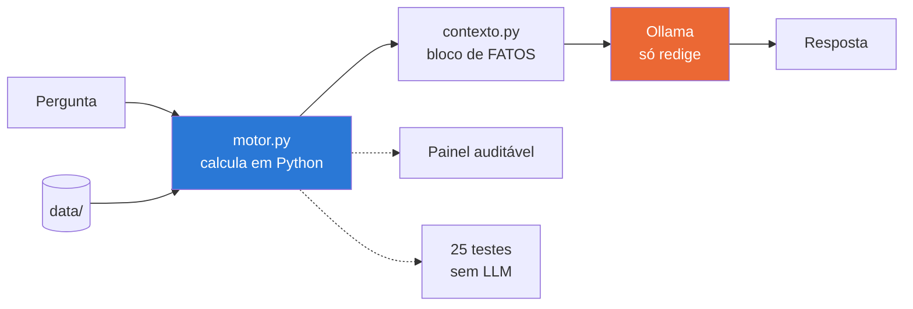

# 🧭 Rumo — Assistente de Planejamento de Metas Financeiras

> Um agente de IA que ajuda a pessoa a descobrir se as metas financeiras dela
> cabem no orçamento. Com uma decisão de arquitetura no centro:
> **o modelo de linguagem não faz contas.**

**Lab da DIO:** [Construa Seu Assistente Virtual Com Inteligência Artificial](https://github.com/digitalinnovationone/dio-lab-bia-do-futuro)
**Autora:** [Andressa Cristiny](https://github.com/AndressaCristiny)

---

## O problema

Quem tem duas metas financeiras costuma avaliar uma de cada vez. O cliente desta
base quer fechar a reserva de emergência até junho de 2026 e juntar a entrada de
um apartamento até dezembro de 2027.

A reserva cabe no orçamento dele? **Cabe** — exige R$ 714,29 por mês, e sobram
R$ 2.202,77.
A entrada cabe? **Cabe** — exige R$ 1.800,00 por mês.

As duas juntas? **Não.** Elas somam R$ 2.514,29 e disputam a mesma sobra.
Faltam **R$ 311,52 todo mês**, e nada no extrato avisa isso.

Esse é o problema que o Rumo resolve. O segundo problema é de confiança: um
assistente financeiro que erra uma conta é pior que nenhum assistente.

## A solução



Em azul, onde os números nascem. Em laranja, onde o texto nasce. Eles não se
misturam — e é isso que torna o agente auditável.

O modelo recebe os valores **já calculados** e a instrução explícita de não
somar, dividir nem estimar. A alucinação mais perigosa em finanças — o erro
aritmético dito com segurança — deixa de ser possível. Não porque o prompt pediu
com jeitinho: porque a conta não passa pelo modelo.

## O que o Rumo faz

- ✅ Lê 3 meses de extrato e calcula quanto sobra de verdade por mês
- ✅ Para cada meta: quanto falta, aporte mensal necessário, se cabe, e quando
  chegaria no ritmo atual
- ✅ **Soma os aportes** e avisa quando o conjunto de metas não cabe
- ✅ Filtra produtos compatíveis por regra — risco, prazo e aporte mínimo
- ✅ Diz "não tenho essa informação" quando é o caso

## O que o Rumo não faz

- ❌ Não recomenda produto específico — explica as alternativas compatíveis
- ❌ Não promete rentabilidade nem projeta retorno futuro
- ❌ Não faz nenhuma conta dentro do modelo de linguagem
- ❌ Não responde fora de planejamento financeiro pessoal
- ❌ Não substitui um profissional certificado

## Os 6 passos do desafio

| # | Etapa | Onde está |
|---|---|---|
| 1 | Documentação do agente | [`docs/01-documentacao-agente.md`](docs/01-documentacao-agente.md) |
| 2 | Base de conhecimento | [`docs/02-base-conhecimento.md`](docs/02-base-conhecimento.md) |
| 3 | Prompts | [`docs/03-prompts.md`](docs/03-prompts.md) |
| 4 | Aplicação funcional | [`src/`](src/) |
| 5 | Avaliação e métricas | [`docs/04-metricas.md`](docs/04-metricas.md) · [`avaliacao/`](avaliacao/) |
| 6 | Pitch | [`docs/05-pitch.md`](docs/05-pitch.md) |

## Avaliação

A camada de cálculo tem **25 verificações automáticas que rodam sem LLM nenhum**:

```bash
python avaliacao/avaliar.py
```

```
=== CORREÇÃO DO CÁLCULO ===             8/8   PASSA
=== CONSISTÊNCIA INTERNA ===            6/6   PASSA
=== REGRAS DE SELEÇÃO DE PRODUTO ===    4/4   PASSA
=== COBERTURA DE FATOS POR PERGUNTA === 7/7   PASSA
------------------------------------------------------------
25/25 verificações automáticas passaram  |  3 casos de recusa para avaliação manual
```

O grupo mais interessante é o último: para cada pergunta prevista, ele checa se
o dado necessário **existe no bloco de fatos**. Uma pergunta sem fato é uma
alucinação esperando para acontecer — e dá para detectar isso sem rodar o modelo.

> **Estado honesto do projeto.** A camada de cálculo está testada e passando. A
> camada de redação **ainda não foi executada** contra um LLM — a rubrica de
> avaliação manual está pronta em [`docs/04-metricas.md`](docs/04-metricas.md) e
> é o próximo passo. As respostas mostradas em [`docs/03-prompts.md`](docs/03-prompts.md)
> são comportamento especificado, não transcrições.

## Como executar

### 1. Instalar o Ollama e baixar um modelo

```bash
# https://ollama.com
ollama serve
ollama pull llama3.2
```

### 2. Instalar as dependências

```bash
pip install -r requirements.txt
```

### 3. Rodar

```bash
streamlit run src/app.py
```

**Sem o Ollama**, a camada de cálculo continua funcionando e é onde está a parte
interessante:

```bash
python src/motor.py        # todos os fatos, em JSON
python src/contexto.py     # o bloco exato que iria para o modelo
python avaliacao/avaliar.py
```

## Estrutura

```
rumo-assistente-metas-financeiras/
├── data/                          # base de conhecimento
│   ├── perfil_investidor.json     # cliente + metas com valor, prazo e progresso
│   ├── transacoes.csv             # 33 lançamentos, 3 meses
│   ├── produtos_financeiros.json  # catálogo com risco e aporte mínimo
│   └── historico_atendimento.csv  # atendimentos anteriores
│
├── docs/                          # os 6 passos documentados
│   ├── 01-documentacao-agente.md
│   ├── 02-base-conhecimento.md
│   ├── 03-prompts.md
│   ├── 04-metricas.md
│   └── 05-pitch.md
│
├── src/
│   ├── motor.py                   # cálculo determinístico — nenhum LLM
│   ├── contexto.py                # bloco de fatos + system prompt
│   └── app.py                     # Streamlit + Ollama
│
└── avaliacao/
    ├── casos.json                 # 28 casos de teste
    └── avaliar.py                 # roda tudo, sem LLM
```

## Decisões que valem ser explicadas

**Por que não usar RAG.** O bloco de fatos tem 3.889 caracteres e cabe folgado
na janela de contexto. Busca semântica aqui seria complexidade sem ganho. Se a
base crescesse para anos de extrato, a decisão mudaria.

**Por que a data de referência é fixa.** O motor usa `HOJE = date(2025, 11, 1)`
em vez de `date.today()`. Sem isso, o número de meses até cada meta mudaria a
cada execução e os testes quebrariam sozinhos com o tempo.

**Por que o cálculo ignora rendimento.** O aporte necessário é divisão simples,
sem juros compostos. É conservador de propósito — contar com rentabilidade
futura seria exatamente o que o agente é proibido de fazer.

**Por que temperatura 0,2.** Em texto financeiro, arredondar "R$ 714,29" para
"cerca de R$ 700" já é perder informação. Aqui não se quer criatividade.

---

Projeto educacional do lab da DIO. Dados mockados, cliente fictício, sem
recomendação de investimento.
