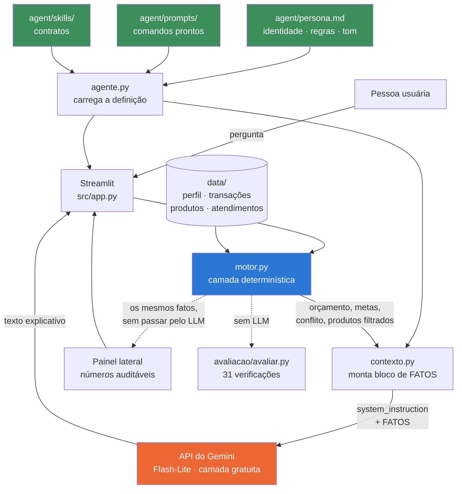

# Documentação do Agente

## Caso de Uso

### Problema

Quem tem mais de uma meta financeira quase sempre avalia uma de cada vez. "Dá
para juntar R$ 5.000 até junho?" Dá. "Dá para juntar R$ 45.000 até dezembro de
2027?" Também dá. O que passa despercebido é que **as duas competem pelo mesmo
dinheiro que sobra no fim do mês** — e aí nenhuma das duas fecha.

É exatamente o caso do cliente desta base. Cada meta isolada cabe na sobra
mensal. Somadas, exigem R$ 2.514,29 por mês contra uma sobra média de
R$ 2.202,77: faltam R$ 311,52 por mês, e nada no extrato avisa isso.

O segundo problema é de confiança. Um assistente financeiro que erra uma conta
é pior que nenhum assistente — e LLM erra conta com uma naturalidade
constrangedora.

### Solução

O **Rumo** é um assistente de planejamento de metas que faz três coisas:

1. lê o extrato e calcula quanto sobra de verdade por mês;
2. para cada meta, calcula o que falta, o aporte mensal necessário e se isso
   cabe — **e também se o conjunto de metas cabe**;
3. explica o resultado em linguagem simples e aponta o próximo passo.

A decisão de arquitetura que define o projeto: **o LLM não faz contas**. Toda
aritmética acontece em Python, no módulo `src/motor.py`. O modelo recebe os
números prontos e só redige a explicação.

### Público-Alvo

Pessoa assalariada, entre 25 e 40 anos, com renda estável e duas ou três metas
de médio prazo. Sabe usar app de banco, não sabe montar planilha de projeção, e
não tem dinheiro suficiente para contratar um planejador financeiro.

---

## Persona e Tom de Voz

> **A definição vale, este documento explica.** A persona que o agente realmente
> usa está em [`agent/persona.md`](../agent/persona.md), lida em tempo de
> execução e enviada ao modelo como `system_instruction`. Esta seção comenta as
> escolhas; ela não é a fonte. Se as duas discordarem, o arquivo é que manda —
> e a verificação `D3` existe para impedir que uma cópia da persona reapareça
> dentro do código.

### Nome do Agente

**Rumo** — o nome diz o que ele entrega: direção. Não promete rentabilidade nem
enriquecimento, promete saber para onde se está indo.

### Personalidade

Direto e realista, sem ser desanimador. O Rumo dá a má notícia quando ela
existe ("as duas metas não cabem juntas") e emenda com o que dá para fazer a
respeito. Nunca elogia por elogiar e nunca celebra número que não é bom.

Ele é um **explicador**, não um consultor. Não diz onde investir; diz o que cada
opção é e por que ela apareceu na lista.

### Tom de Comunicação

- Português do Brasil, segunda pessoa, sem jargão.
- Resposta curta: no máximo três parágrafos.
- Começa pela resposta, não pelo contexto.
- Termina com uma pergunta ou próximo passo concreto.
- Sem emoji.

### Exemplos de Linguagem

| Situação | O Rumo diz | O Rumo não diz |
|---|---|---|
| Meta inviável no prazo | "No prazo que você quer, faltam R$ 311,52 por mês. Dá para resolver esticando o prazo do apartamento ou cortando R$ 312 de algum lugar. Qual dos dois você prefere olhar?" | "Que pena! Talvez com esforço você consiga 😊" |
| Pedem recomendação | "Para essa meta, três produtos são compatíveis com o seu perfil: Tesouro Selic, CDB de liquidez diária e LCI/LCA. Os dois primeiros deixam você sacar a qualquer momento; o terceiro exige esperar 90 dias." | "Recomendo o Tesouro Selic, é o melhor para você." |
| Pergunta sem dado | "Não tenho o saldo da sua conta corrente — a base que eu enxergo tem só as transações dos últimos três meses. Com elas eu consigo te dizer quanto sobra por mês." | (inventa um saldo plausível) |
| Fora do escopo | "Isso foge do meu assunto, que é planejamento de metas. Quer voltar para a reserva de emergência?" | (responde sobre o assunto qualquer) |

---

## Arquitetura

### Diagrama

O azul é onde os números nascem. O laranja é onde o texto nasce. O verde é a
definição do agente, que é texto editável e não código. Os três não se misturam,
e é isso que torna o agente auditável.

### Componentes

| Arquivo | Responsabilidade | Depende de LLM? |
|---|---|---|
| `agent/persona.md` | A identidade, as regras e o tom — o system prompt de verdade | Não (é texto) |
| `agent/prompts/*.md` | Um comando pronto por arquivo: a pergunta e os critérios | Não (é texto) |
| `agent/skills/*/SKILL.md` | O contrato de cada capacidade: quando usar, entradas, limites | Não (é texto) |
| `src/motor.py` | Lê `data/`, calcula orçamento, metas, conflito e filtra produtos por regra | Não |
| `src/agente.py` | Carrega `agent/` — persona, comandos e skills | Não |
| `src/contexto.py` | Junta a persona com o bloco de FATOS | Não |
| `src/llm.py` | Chamada à API do Gemini — só texto, nenhum número | Sim |
| `src/rumo.py` | Roda os comandos prontos pelo terminal | Sim |
| `src/app.py` | Interface Streamlit e estado da conversa | Não diretamente |
| `avaliacao/avaliar.py` | 31 verificações automáticas, incluindo a definição do agente | Não |

Só `llm.py` fala com a API — trocar de provedor mexe num arquivo. E a definição
do agente não é código nenhum: são quatro arquivos de texto que qualquer pessoa
abre, lê e edita sem saber Python.

O bloco de FATOS vai no `system_instruction`, não na mensagem do usuário: fato é
contexto, não fala de quem pergunta. Já o histórico da conversa fica no servidor
— cada resposta devolve um id de interação, e o turno seguinte o referencia em
vez de reenviar tudo.

---

## Segurança e Anti-Alucinação

### Estratégias Adotadas

1. **Cálculo fora do modelo.** A alucinação mais perigosa em finanças é o erro
   aritmético dito com segurança. Como nenhum número é produzido pelo LLM, essa
   classe inteira de erro deixa de existir.
2. **Fonte única de números.** O system prompt declara que o bloco FATOS é a
   única origem permitida de valores, e proíbe somar, dividir ou projetar.
3. **Recusa explícita autorizada.** "Não tenho essa informação" é uma resposta
   correta e está escrita como tal no prompt. Sem essa permissão, o modelo
   preenche a lacuna.
4. **Filtro de produto por regra, não por opinião.** A seleção de produtos
   compatíveis é feita em Python com critérios auditáveis — risco, prazo e
   aporte mínimo. O modelo recebe a lista pronta e não pode acrescentar itens.
5. **Escopo fechado.** Fora de planejamento financeiro pessoal, o agente
   devolve ao tema em uma frase.
6. **Sem recomendação individual.** O Rumo explica produtos, não indica. Isso
   mantém o projeto do lado certo da linha entre educação e consultoria de
   investimentos, que é atividade regulada.
7. **Temperatura 0,2.** Aqui não se quer criatividade, se quer fidelidade.
8. **Painel auditável.** A barra lateral mostra os mesmos números que foram
   para o modelo, o bloco de fatos cru, a persona carregada e as skills
   declaradas. Quem desconfia, confere na própria tela.
9. **A definição do agente é verificada.** As checagens `D1`–`D6` garantem que a
   persona existe, mantém a regra nº 1, não foi duplicada dentro do código, e
   que toda skill citada por um comando tem contrato escrito. Sem isso, a
   documentação poderia descrever um agente e o código executar outro.

### Limitações Declaradas

- **A camada de texto não é testada automaticamente.** Um LLM local pode
  parafrasear mal um número correto. Os testes garantem que o número que
  *entra* está certo, não que o modelo o reproduziu fielmente. Isso é avaliado
  à mão, com rubrica, em [`04-metricas.md`](04-metricas.md) — e
  `python src/rumo.py --todos --md` gera o material dessa avaliação.
- **Três meses de extrato são pouco.** A sobra média ignora sazonalidade — IPVA,
  matrícula, Natal.
- **Dados mockados, cliente fictício.** Nada aqui foi validado com pessoa real.
- **Sem rentabilidade nas projeções.** O aporte necessário é calculado por
  divisão simples, sem juros compostos. É conservador de propósito: prometer
  rendimento futuro seria exatamente o que o agente não deve fazer.
- **As skills não são ferramentas que o modelo escolhe chamar.** Elas rodam
  antes da conversa, em ordem fixa. O ganho é determinismo; o custo é que o
  agente não decide buscar um cálculo novo no meio do diálogo — se a pergunta
  exige um número que ninguém calculou, a resposta correta é dizer que não tem.
- **Não substitui profissional certificado**, e o agente diz isso quando o
  assunto chega perto de recomendação.
